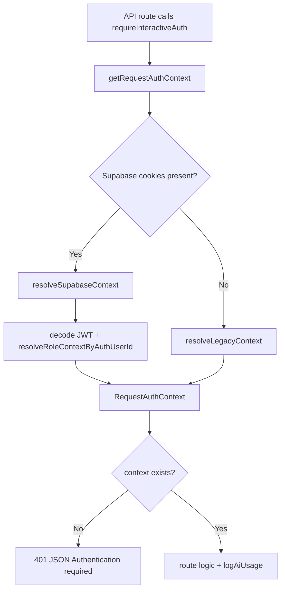
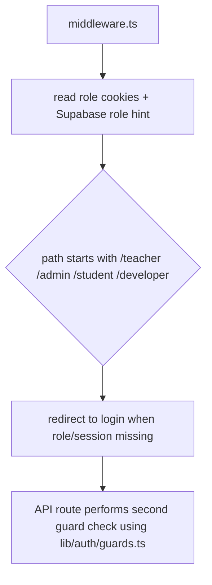

# VidyaPath Deep Function-to-Function Mapping

Last updated: 2026-04-09

This document is the engineering map for how VidyaPath works end-to-end:
- UI route to API route
- API route to service/library function
- service function to Supabase tables
- auth and RBAC checks on each flow

## 1) Core Runtime Layers

1. UI layer
- Next.js App Router pages in `app/**/page.tsx`
- Reusable React components in `components/**`

2. API layer
- Route handlers in `app/api/**/route.ts`

3. Domain/service layer
- AI: `lib/ai/*`
- Auth/RBAC: `lib/auth/*`, `lib/platform-rbac-db.ts`, `middleware.ts`
- Teacher/Admin/Student data workflows: `lib/teacher-admin-db.ts`, `lib/teacher-assignment.ts`

4. Persistence layer
- Supabase REST helpers in `lib/supabase-rest.ts`
- Write safety guard in `lib/persistence/teacher-storage.ts`
- Schema in `scripts/sql/supabase_init.sql`

## 2) Authentication and RBAC Call Chains

## 2.1 Interactive AI guard chain

Files:
- `lib/auth/interactive.ts`
- `lib/auth/guards.ts`
- `lib/auth/supabase-auth.ts`
- `lib/platform-rbac-db.ts`

## 2.2 Route-level access guard chain

Notes:
- Middleware is first-line guard for pages.
- API handlers still perform server-side guard checks (defense in depth).

## 3) Route-to-Endpoint-to-Function Mapping

## 3.1 Public + Discovery Routes

| UI Route | Main Components/Files | API Calls | Library Functions |
|---|---|---|---|
| `/` | `app/page.tsx` | none (static) | `lib/data.ts`, `lib/pyq.ts` via render data |
| `/chapters` | `app/chapters/page.tsx` | `POST /api/analytics/track` | `trackChapterView` |
| `/chapters/[id]` | `app/chapters/[id]/page.tsx`, `components/ChapterIntelligenceHub.tsx`, `components/AIChatBox.tsx` | ai + chapter intelligence + teacher feed | `generateTaskJson/Text`, `getContextPack`, `getPublicTeacherConfig` |
| `/papers` | `app/papers/page.tsx` | none required | `lib/papers.ts` |
| `/formulas` | `app/formulas/page.tsx` | none | `getAllFormulaEntries` |
| `/equations` | `app/equations/page.tsx` | none | `getAllFormulaEntries`, `FORMULA_SOURCE_DOCS` |
| `/api-lab` | `app/api-lab/page.tsx` | calls all configured endpoints from browser | role-aware endpoint execution |

## 3.2 Student Session and Assessment Routes

| UI Route | API | Main Function Chain |
|---|---|---|
| `/student/login` | `POST /api/student/session/login` | `findStudentAuthIdentity` -> `signInWithPassword` -> `attachSupabaseSessionCookies` + legacy cookie |
| `/practice/assignment/[packId]` | `GET /api/teacher/assignment-pack?id=...`, `POST /api/teacher/submission`, `GET /api/student/submission-results` | `getAssignmentPack` -> `addSubmission` -> `getStudentSubmissionResults` |
| `/exam/assignment/[packId]` | `POST /api/exam/session/start`, `/heartbeat`, `/submit` | `startExamSession` -> `recordExamHeartbeat` -> `completeExamSession` + `addSubmission` |
| `/dashboard` | chapter intelligence APIs + revision plan | `buildLearningProfile`, AI pipelines, progress stores |

## 3.3 Teacher and Admin Routes

| UI Route | API | Main Function Chain |
|---|---|---|
| `/teacher/login` | `POST /api/teacher/session/login` | `findTeacherAuthIdentity` -> `signInWithPassword` -> `attachSupabaseSessionCookies` + legacy cookie |
| `/teacher` | `GET/POST /api/teacher`, `/api/teacher/assignment-pack*`, `/api/teacher/submission*`, `/api/teacher/question-bank/item*` | `getPrivateTeacherConfig`, `upsertAssignmentPack`, `gradeSubmission`, `releaseSubmissionResults`, question-bank CRUD |
| `/admin/login` | `POST /api/admin/session/bootstrap` | auth identity resolve + Supabase session cookie + admin session cookie |
| `/admin` | `/api/admin/teachers*`, `/api/admin/students*`, `/api/admin/overview` | teacher/student CRUD + overview rollups |
| `/developer` | `/api/developer/*` | school provisioning + token/audit analytics |

## 4) API Endpoint Function Map (Detailed)

## 4.1 AI + Chapter Intelligence Endpoints

| Endpoint | Guard | Main Functions |
|---|---|---|
| `POST /api/ai-tutor` | `requireInteractiveAuth` | `normalizeMessages` -> `getContextPack` -> `generateTaskText` -> `trackAiQuestion` -> `logAiUsage` |
| `POST /api/generate-quiz` | `requireInteractiveAuth` | `getContextPack` -> `generateTaskJson` -> `normalizeMCQs` -> dynamic fallback -> `logAiUsage` |
| `POST /api/generate-flashcards` | `requireInteractiveAuth` | `getContextPack` -> `generateTaskJson` -> `normalizeFlashcards` -> dynamic fallback -> `logAiUsage` |
| `POST /api/image-solve` | `requireInteractiveAuth` | Gemini Vision call -> JSON normalize -> `logAiUsage` |
| `POST /api/chapter-pack` | `requireInteractiveAuth` | `getContextPack` -> `generateTaskJson` -> chapter/PYQ sanitization -> fallback |
| `POST /api/chapter-drill` | `requireInteractiveAuth` | `getContextPack` -> `generateTaskJson` -> strict count top-up -> fallback |
| `POST /api/chapter-diagnose` | `requireInteractiveAuth` | `buildLearningProfile` -> AI diagnose -> normalized weak tags/task types |
| `POST /api/chapter-remediate` | `requireInteractiveAuth` | AI day-plan -> focus alignment -> fallback |
| `POST /api/context-pack` | `requireInteractiveAuth` | `getContextPack` only (debug/internal retrieval visibility) |
| `POST /api/adaptive-test` | `requireInteractiveAuth` | `getContextPack` -> `generateTaskJson` -> chapter-aligned filtering + top-up |
| `POST /api/revision-plan` | `requireInteractiveAuth` | AI week-plan -> chapter-id sanitization -> fallback heuristic |
| `POST /api/paper-evaluate` | `requireInteractiveAuth` | AI rubric estimate -> section/weak-topic normalization -> fallback heuristic |

## 4.2 Teacher/Student Assessment Endpoints

| Endpoint | Guard | Main Functions |
|---|---|---|
| `GET /api/teacher` | teacher session optional, student session optional | teacher: `getPrivateTeacherConfig`; public/student: `getPublicTeacherConfig` |
| `POST /api/teacher` | teacher session required | `setImportantTopics` / `setQuizLink` / `addAnnouncement` / `removeAnnouncement` / `upsertAssignmentPack` |
| `GET /api/teacher/assignment-pack` | teacher full access else student + published check | `getAssignmentPack` + class/section checks |
| `POST /api/teacher/assignment-pack` | teacher required + writable storage | `buildTeacherAssignmentPackDraft` -> `upsertAssignmentPack` (draft status) |
| `POST /api/teacher/assignment-pack/regenerate` | teacher required + scope check | regenerate with feedback |
| `POST /api/teacher/assignment-pack/approve` | teacher required | `updateAssignmentPackStatus(status=review/approved metadata)` |
| `POST /api/teacher/assignment-pack/publish` | teacher required | `updateAssignmentPackStatus(status=published)` |
| `POST /api/teacher/assignment-pack/archive` | teacher required | `updateAssignmentPackStatus(status=archived)` |
| `POST /api/teacher/question-bank/item` | teacher required | `createTeacherQuestionBankItem` |
| `GET /api/teacher/question-bank/item` | teacher required | `listTeacherQuestionBank` |
| `PATCH/DELETE /api/teacher/question-bank/item/[id]` | teacher required | update/delete question bank item |
| `POST /api/teacher/submission` | student required + pack scope checks | `evaluateTeacherAssignmentSubmission` -> `addSubmission` |
| `POST /api/teacher/submission/grade` | teacher required | `gradeSubmission` |
| `POST /api/teacher/submission/release-results` | teacher required | `releaseSubmissionResults` |
| `GET /api/teacher/submission-summary` | teacher required | `getTeacherSubmissionSummary` |

## 4.3 Exam Integrity Endpoints

| Endpoint | Guard | Main Functions |
|---|---|---|
| `POST /api/exam/session/start` | student required + class/section checks | `startExamSession` |
| `POST /api/exam/session/heartbeat` | student required + session owner check + class/section checks | `getExamSession` -> `recordExamHeartbeat` |
| `POST /api/exam/session/submit` | student required + session owner check + class/section checks | `completeExamSession` -> `evaluateTeacherAssignmentSubmission` -> `addSubmission` |

Security patch added on 2026-04-09:
- heartbeat now verifies logged-in student identity against `submissionCode` and pack scope before recording integrity events.

## 4.4 Admin / Developer / Integrations

| Endpoint | Guard | Main Functions |
|---|---|---|
| `/api/admin/session/*` | bootstrap open, `me/logout` guarded | Supabase session cookie + legacy cookie support |
| `/api/admin/teachers*` | admin required | `listTeachers`, `createTeacher`, `updateTeacher`, scope add/remove, pin reset |
| `/api/admin/students*` | admin required | `listStudents`, `createStudent`, `updateStudent` |
| `/api/admin/overview` | admin required | `getAdminOverview` |
| `/api/developer/*` | developer required | school directory, audits, token usage rollups |
| `/api/integrations/sheets/status` | teacher or admin required | `getSheetsStatus` |
| `/api/integrations/sheets/export` | teacher/admin required + pack access checks | `exportToSheets` |
| `/api/integrations/sheets/import` | teacher required | `importFromSheets` -> `gradeSubmission` / `releaseSubmissionResults` |

## 5) Supabase Table Mapping

## 5.1 Identity + Tenant
- `schools`
- `school_admin_profiles`
- `platform_user_roles`
- `token_usage_events`

## 5.2 Teacher Operations
- `teacher_profiles`
- `teacher_scopes`
- `teacher_activity`
- `teacher_announcements`
- `teacher_quiz_links`
- `teacher_topic_priority`
- `teacher_assignment_packs`
- `teacher_question_bank`
- `teacher_submissions`
- `exam_sessions`
- `exam_violations`

## 5.3 Student Operations
- `student_profiles`

## 5.4 Legacy/Bridge
- `app_state`
- `teacher_weekly_plans` (legacy compatibility only)

Schema source:
- `scripts/sql/supabase_init.sql`

## 6) Logging and Observability Mapping

## 6.1 AI token usage
- API route calls `logAiUsage`
- `logAiUsage` calls `recordTokenUsageEvent`
- Persisted to `token_usage_events`

## 6.2 Teacher activity audit
- teacher/admin actions call `logTeacherActivity`
- persisted to `teacher_activity`

## 6.3 Exam integrity
- `/api/exam/session/heartbeat` writes violations to `exam_violations`
- session aggregates in `exam_sessions.violation_counts`
- submission payload carries `integritySummary`

## 7) Deployment Readiness Checklist (Function-Level)

1. Auth/rbac checks
- `GET /api/auth/session` reflects correct role after each login/logout flow.
- unauthorized access returns `401/403` for protected endpoints.

2. Storage health
- `assertTeacherStorageWritable` is invoked on teacher/admin write routes.
- in production mode, writes fail fast with actionable `503` if Supabase is misconfigured.

3. Assignment lifecycle
- draft not visible to students.
- published visible in chapter scope feed and practice route.
- grading and release gates student result visibility.

4. Exam integrity
- start -> heartbeat -> submit path succeeds only for session owner and eligible class/section.

5. Token analytics
- AI endpoints create `token_usage_events` rows.

## 8) Known Residual Risks (Post-Static Audit)

1. No runtime rate-limiting middleware in this repo for AI endpoints.
- Mitigation: add per-user/IP rate limits at edge or route level.

2. CSP header is not currently configured in `next.config.js`.
- Mitigation: add strict Content-Security-Policy with tested allowlist.

3. Full e2e verification could not be executed in this environment because `node`/`npm` are unavailable in PATH.
- Mitigation: run the runbook checks in a Node-enabled shell before release.